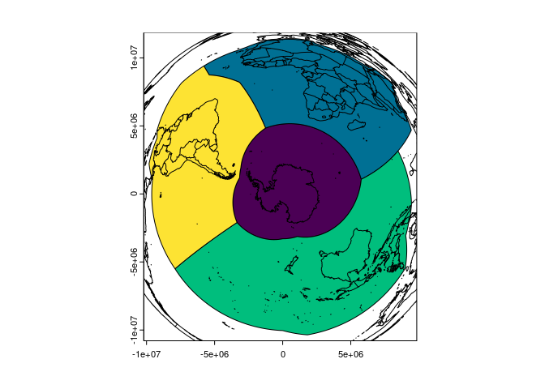

<!-- README.md is generated from README.Rmd. Please edit that file -->

# equi7grid

<!-- badges: start -->

[](https://github.com/mdsumner/equi7grid/actions/workflows/R-CMD-check.yaml)
<!-- badges: end -->

The goal of equi7grid is … currently a barebones get equi7 and plot it.

The [Equi7Grid](https://github.com/TUW-GEO/Equi7Grid) is a project that
aims to define 7 global zones that are better than the current UTM and
MGRS grid for classifying high resolution satellite imagery. Here we
provide a single simple endpoint Geopackage url with the 7 zones in it
with straightforward layer names:

    "/vsicurl/https://github.com/mdsumner/equi7grid/raw/main/data-raw/equi7grid.gpkg"

The layers are these (note ‘NA’ is slightly unfortunate in R, but oh
well).

    "AF", "AN", "AS", "EU", "NA", "OC", "SA"

## Example

This plots each zone with its local centre in native Azimuthal
Equidistant projection, the orange point shows the poles when they are
in the frame.

Note that we have a single vector source Geopackage, with the 7 zones in
it, each in their own native projection.

``` r
library(equi7grid)
dsn <- "/vsicurl/https://github.com/mdsumner/equi7grid/raw/main/data-raw/equi7grid.gpkg"


m <- do.call(cbind, maps::map(plot = F)[1:2])
library(terra)
#> terra 1.7.71
layers <- vector_layers(dsn)
par(mfrow = n2mfrow(length(layers)), mar = rep(0, 4))
for (i in seq_along(layers)) {
  v <- vect(dsn, layers[i])
  ex <- as.vector(ext(v))
  m1 <- project(m, to = crs(v), from = "EPSG:4326")
  m1 <- m1[m1[,1] >= ex[1] & m1[,1] <= ex[2] & m1[,2] >= ex[3] & m1[,2] <= ex[4], ]
  plot(NA, axes = FALSE, xlim = ex[1:2], ylim = ex[3:4], asp = 1, xlab = "", ylab = "")
  plot(v, axes = F, border = "firebrick", add = TRUE)
  lines(m1, col = rgb(0, 0, 0, .5))
  pt <- cbind(0, c(-90, 90))
  p0 <- project(pt, to = crs(v), from = "EPSG:4326")
points(p0, pch = "+", cex = 2, col = "orange")
box(col = "lightgrey")

}
#> Warning: [project] 1972 failed transformations

#> Warning: [project] 1972 failed transformations

#> Warning: [project] 1972 failed transformations

#> Warning: [project] 1972 failed transformations

#> Warning: [project] 1972 failed transformations

#> Warning: [project] 1972 failed transformations

#> Warning: [project] 1972 failed transformations
```


In the package we can read the entire set from a single FlatGeobuf, but
you’ll need to use them locally as they don’t make sense in one single
CRS.

The crs is recorded on each, but obviously we can craft our own scene
and projection, here we just focus on the south in LAEA.

``` r
library(equi7grid)
fgb <- system.file("extdata/equi7_longlat.fgb", package = "equi7grid", mustWork = TRUE)
library(terra)
x <- vect(fgb)
m <- do.call(cbind, maps::map(plot = F)[1:2])
crs <- "+proj=laea +lat_0=-90"
plot(project(x[-(3:5), ], crs), col = hcl.colors(4))
lines(project(m, to = crs, from = "EPSG:4326"))
#> Warning: [project] 1972 failed transformations
```



## Code of Conduct

Please note that the equi7grid project is released with a [Contributor
Code of
Conduct](https://contributor-covenant.org/version/2/1/CODE_OF_CONDUCT.html).
By contributing to this project, you agree to abide by its terms.
