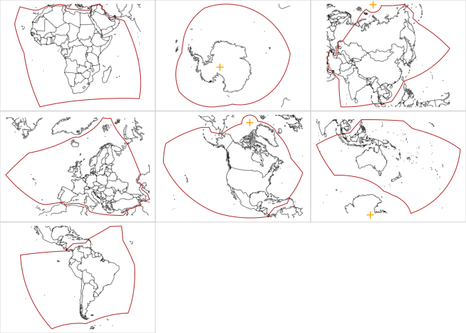

<!-- README.md is generated from README.Rmd. Please edit that file -->

# equi7grid

<!-- badges: start -->
<!-- badges: end -->

The goal of equi7grid is … currently a barebones get equi7 and plot it.

## Example

This is a basic example which shows you how to solve a common problem:

``` r

f <- fs::dir_ls("data-raw", regexp = "fgb$")
crs <- c(AF = '+proj=aeqd +lat_0=8.5 +lon_0=21.5 +x_0=5621452.01998 +y_0=5990638.42298 +datum=WGS84 +units=m +no_defs',
AN =  '+proj=aeqd +lat_0=-90 +lon_0=0 +x_0=3714266.97719 +y_0=3402016.50625 +datum=WGS84 +units=m +no_defs',
AS =  '+proj=aeqd +lat_0=47 +lon_0=94 +x_0=4340913.84808 +y_0=4812712.92347 +datum=WGS84 +units=m +no_defs',
EU =  '+proj=aeqd +lat_0=53 +lon_0=24 +x_0=5837287.81977 +y_0=2121415.69617 +datum=WGS84 +units=m +no_defs',
"NA" =  '+proj=aeqd +lat_0=52 +lon_0=-97.5 +x_0=8264722.17686 +y_0=4867518.35323 +datum=WGS84 +units=m +no_defs',
OC =  '+proj=aeqd +lat_0=-19.5 +lon_0=131.5 +x_0=6988408.5356 +y_0=7654884.53733 +datum=WGS84 +units=m +no_defs',
SA =  '+proj=aeqd +lat_0=-14 +lon_0=-60.5 +x_0=7257179.23559 +y_0=5592024.44605 +datum=WGS84 +units=m +no_defs')
m <- do.call(cbind, maps::map(plot = F)[1:2])
library(terra)
#> terra 1.7.71
par(mfrow = n2mfrow(length(f)), mar = rep(0, 4), xpd = NA)
for (i in seq_along(f)) {
  v <- vect(f[i])
  ex <- as.vector(ext(v))
  m1 <- project(m, to = crs[i], from = "EPSG:4326")
  m1 <- m1[m1[,1] >= ex[1] & m1[,1] <= ex[2] & m1[,2] >= ex[3] & m1[,2] <= ex[4], ]
  plot(NA, axes = FALSE, xlim = ex[1:2], ylim = ex[3:4], asp = 1, xlab = "", ylab = "")
  plot(v, axes = F, border = "firebrick", add = TRUE)
  lines(m1, col = rgb(0, 0, 0, .5))
}
#> Warning: [project] 1972 failed transformations

#> Warning: [project] 1972 failed transformations

#> Warning: [project] 1972 failed transformations

#> Warning: [project] 1972 failed transformations

#> Warning: [project] 1972 failed transformations

#> Warning: [project] 1972 failed transformations

#> Warning: [project] 1972 failed transformations
```


